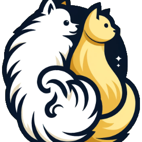
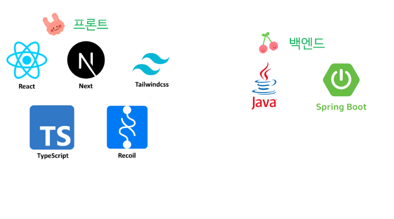
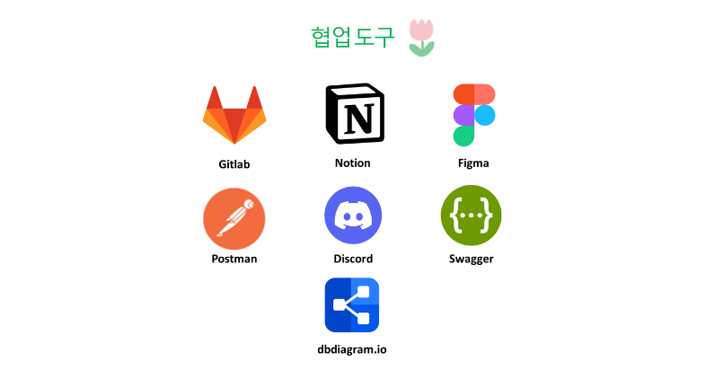
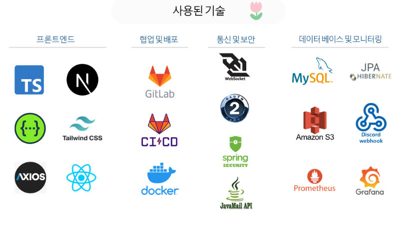

## 🐶 꼬랑지랑 : 반려동물 용품전용 쇼핑몰 🐱

  

## 👩‍💻 배포링크 👨‍💻
https://ggorangjirang.duckdns.org/

## 1️⃣ 소개

<aside>
💡 귀여운 강아지, 고양이 전용물품 쇼핑몰! 꼬랑지랑에 어서오세요!

</aside>

## 2️⃣ 페르소나

<table>
  <tr>
    <td align="center" valign="middle"></td>
    <td>
      <strong> 🗓️ 사랑스러운 반려동물을 위한 쇼핑몰 웹 서비스</strong> 
      <ul>
        <li>집에서 주로 쇼핑하며, 다양한 제품을 비교하여 최적의 상품을 찾는 사람들</li>
        <li>반려동물의 건강과 행복을 최우선으로 고려하여 제품을 선택하고 싶은 사람들</li>
        <li>신뢰할 수 있는 리뷰와 상품 추천을 통해 최고의 제품을 선택하고 싶은 사람들</li>
        <li>강아지를 위한 고품질 사료와 건강 보조제를 구매 하고싶은 사람들</li>
      </ul>
    </td>
  </tr>
</table>

## 2️⃣ 시연영상

https://github.com/user-attachments/assets/8e177c0d-71c0-476e-8142-ac02d46a5bf2

## 3️⃣ 기술스택

  

 

## 4️⃣ 협업도구

  

 
## 5️⃣ 사용된 기술

  

### 6️⃣ 각 팀원의 역할과 기여한 부분
| 이름 | 프론트엔드  |
| --- | --- |
| 강예정 | 메인페이지 , 상품리스트 페이지, 상품상세 페이지, 장바구니 페이지, 리뷰 기능, 상품주문 기능 |
| 주현정 | 회원가입, 개인정보수정, 카카오 로그인, 카카오 결제 |

| 이름 | 백엔드 |
| --- | --- |
| 민경진 | 배송정보, 웹소켓 |
| 민지원 | 회원가입, jwt인증, OAuth2 로그인 |
| 박영진 | 장바구니 및 장바구니 관련 api |
| 박종민 | 주문 도메인 및 주문관련 api , 디스코드 웹훅, 예외처리 |
| 조웅진(팀장) | 카테고리, 상품, 리뷰 도메인 api , Amazon S3, 이메일 연동, 디스코드 웹 훅 |
| 지준혁 | 빌드 서버 구성, 배포 서버 구성, 모니터링 서버 구성, 매출 관련 집계 데이터 제공 |